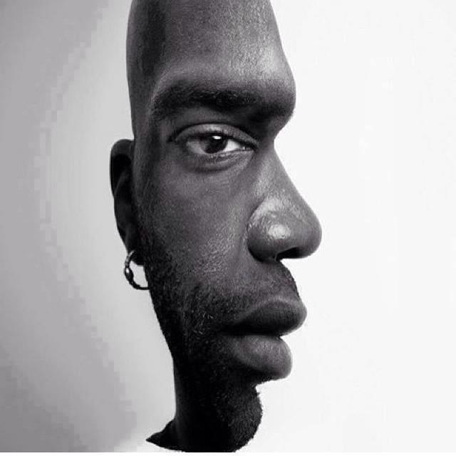

<!DOCTYPE html>
<html>
<head>
    <title>Ways of Seeing</title>
</head>
<body style= "background-color: rgb(247, 164, 195)">
    <h1
       style = "font-size: 40px;font-family: 'Ariel', sans-serif;text-align: center;" >Response to Ways of Seeing</h1>
    
        

       <a href="button.html" style= "font-size: 25px;font-family: 'Ariel', sans-serif;text-align: center">Thoughts</a>

    <h2
    style = "font-size: 25px;font-family: 'Ariel', sans-serif;text-align: left;" >Perspective lies in the eyes of the beholder</h2>

    

<!--
**aashnasoni/aashnasoni** is a ✨ _special_ ✨ repository because its `README.md` (this file) appears on your GitHub profile.

Here are some ideas to get you started:

- 🔭 I’m currently working on ...
- 🌱 I’m currently learning ...
- 👯 I’m looking to collaborate on ...
- 🤔 I’m looking for help with ...
- 💬 Ask me about ...
- 📫 How to reach me: ...
- 😄 Pronouns: ...
- ⚡ Fun fact: ...
-->
